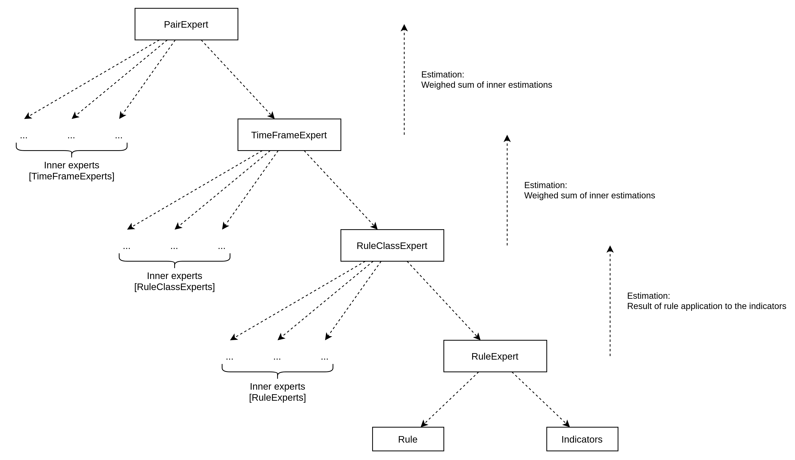
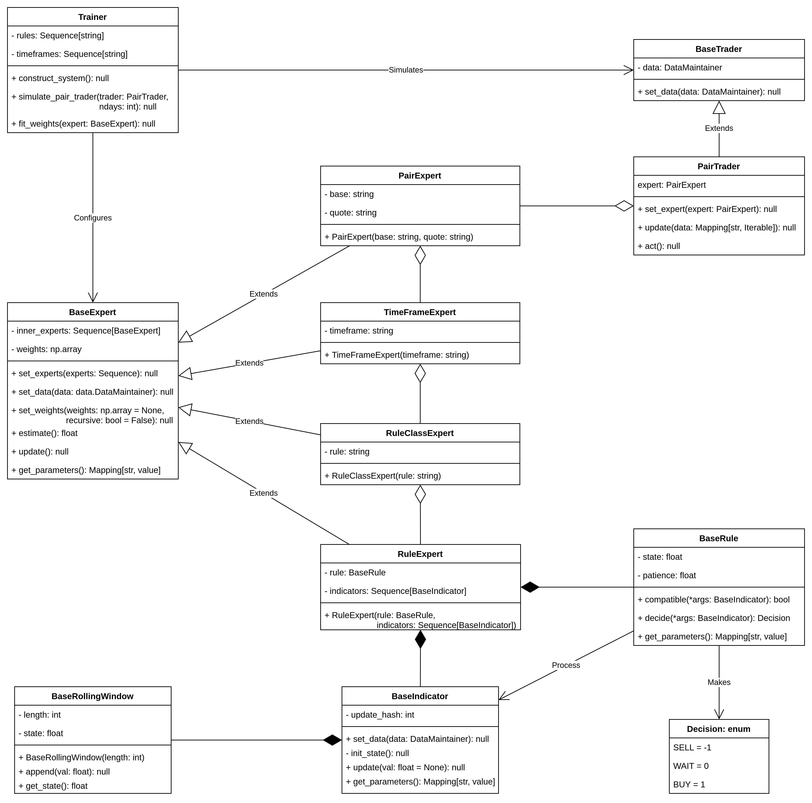
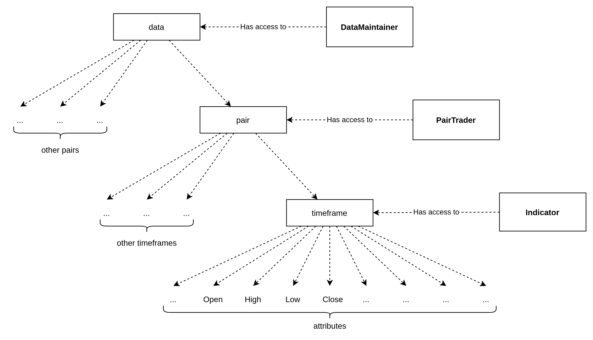

# CRY: Cryptocurrency trading system

## CRY is an expert-based cryptocurrency trading system

There are four levels of expert hierarchy, listed from top to bottom: 

* PairExpert - Handles trading pair (e.g. BTC/USDT)
* TimeFrameExpert - Handles trading timeframe (e.g. 1 day)
* RuleClassExpert - Handles trading rule (e.g. MA Crossover)
* RuleExpert - Handles trading rule with specific parameters (e.g. MA Crossover (200, 50))

Every expert makes an estimation by a weighted sum of its inner experts (one hierarchy level lower). The lowest level yields the result of rule application to its indicators.

## Expert hierarchy

## Researched rules

* MA Crossover
* EMA Crossover
* RSI Threshold
* TRIX Change in direction
* MACD Signal line
* Ichimoku rules
* BB rules

## Algorithm

Every expert of the lowest level from specified search space of parameters was constructed and evaluated on a small period of time. Later tested expert was constructed by specified timeframes, rules, and the best experts of the lowest level. So essentially, this expert model is a linear combination of signals generated by trading rules. Weights tuning of the model was accomplished by bottom-up evolutionary strategy.

## Discoveries

Different configurations were tested. All the models suffer from overfitting and perform poorly on test data. The continuation of profit raise may only be due to the price increase of tested trading pair.

Apparently, researched trading rules and their signals do not give enough information. And such a system may not be used to make market estimation and therefore profit.

It is also possible that the failure of the system is due to the high volatility of the cryptocurrency market.

## System architecture

## DataMaintainer

DataMaintainer class is used for the convenient handling of tree-like data structures.

The following data structuring was used in the system.

